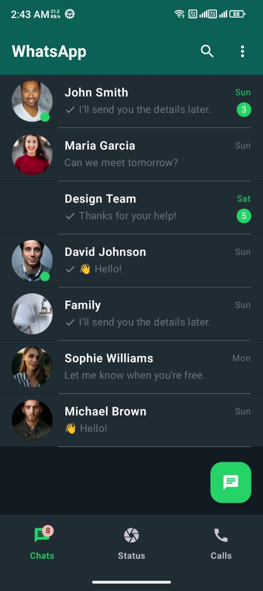
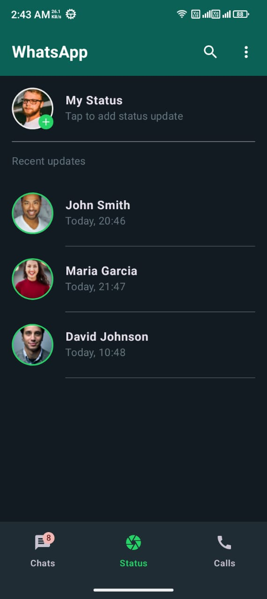
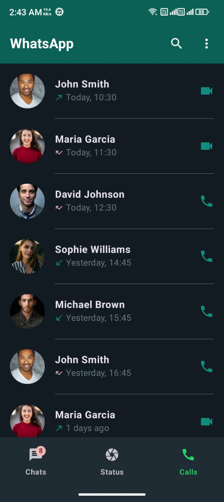
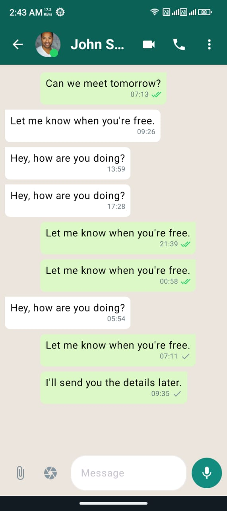

# WhatsApp Clone


<p align="center">
  
   
  
  
</p>

## 📱 About

This project is a modern, visually enhanced clone of WhatsApp built entirely with Jetpack Compose. It features a sleek, Material 3 design that maintains the familiar WhatsApp experience while adding aesthetic improvements and modern UI elements.

### Key Features

- **Modern Material 3 Design** - Clean, intuitive interface with enhanced visual elements
- **Dark/Light Theme Support** - Automatically adjusts based on system settings
- **Tab Navigation** - Smooth navigation between Chats, Status, and Calls
- **Real-time Chat Interface** - Realistic chat bubbles with delivery statuses
- **Status Updates** - View and create status updates
- **Call History** - Complete call log with video and audio call support
- **Optimized Performance** - Fast loading and smooth animations

## 🛠️ Built With

- [Kotlin](https://kotlinlang.org/) - Primary programming language
- [Jetpack Compose](https://developer.android.com/jetpack/compose) - Modern UI toolkit
- [Material 3](https://m3.material.io/) - Design system
- [Navigation Compose](https://developer.android.com/jetpack/compose/navigation) - Navigation framework
- [Coil](https://coil-kt.github.io/coil/) - Image loading library


## ⚙️ Getting Started

### Prerequisites

- Android Studio Flamingo or later
- Android SDK 33 or higher
- Kotlin 1.9.0 or higher

### Installation

1. Clone the repository
   ```bash
   git clone https://github.com/bivashx99/WhatsAppClone.git
   ```

2. Open the project in Android Studio

3. Sync the Gradle files

4. Run the app on an emulator or physical device

## 📝 Project Structure

The project follows a clean architecture approach with the following structure:

```
app/
├── src/main/
│   ├── java/com/bivashmallick/whatsappclone/
│   │   ├── data/           # Data models and sample data
│   │   ├── presentation/   # UI components and screens
│   │   │   ├── components/ # Reusable UI components
│   │   │   ├── navigation/ # Navigation structure
│   │   │   └── screens/    # Main app screens
│   │   └── ui/theme/       # Theme configuration
│   └── res/                # Resources
└── build.gradle           # Project dependencies
```

## 🚀 Future Enhancements

- End-to-end encryption implementation
- Firebase integration for real-time messaging
- Cloud storage for media files
- Group chat functionality enhancement
- Voice and video call implementation
- Message search functionality

## ©️ Copyright Notice

**Copyright © 2024 Bivash Mallick. All Rights Reserved.**

This project and its contents, including all source code, designs, and assets, are the exclusive property of Bivash Mallick. Unauthorized use, reproduction, modification, distribution, or any form of exploitation of this project, in whole or in part, is strictly prohibited without the explicit written permission of the copyright holder.

For permissions or inquiries, please contact:
- Email: official.bivashmallick@gmail.com
- GitHub: [github.com/bivashx99](https://github.com/bivashx99)

---

<div align="center">
  <p>Designed and developed with ❤️ by Bivash Mallick</p>
  <p>
    <a href="https://github.com/bivashx99">GitHub</a>
  </p>
</div> 
